# UML-диаграммы системы

> Полный набор диаграмм проектирования
---

## Use Case Diagram

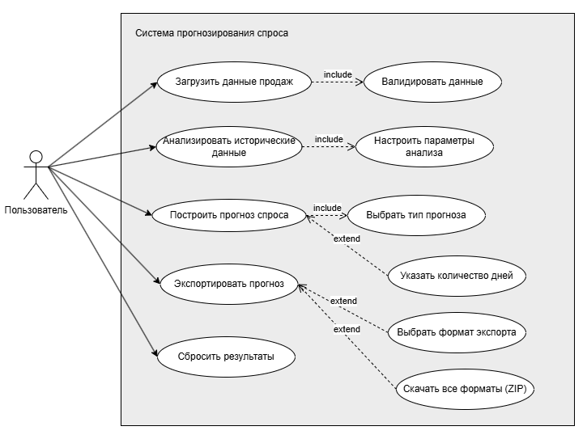

**Назначение:** Сценарии взаимодействия пользователя с системой

**Главные прецеденты:**
- UC-001: Загрузить данные продаж
- UC-002: Построить прогноз спроса
- UC-003: Провести сценарный анализ
- UC-004: Экспортировать результаты

**Включения (include):**
- Валидировать данные (обязательно при загрузке)
- Выбрать тип прогноза (один товар / все товары)

**Расширения (extend):**
- Указать количество дней (7-30, по умолчанию 14)
- Изменить цену для сценария (-90% до +90%)
- Выбрать формат экспорта
- Скачать все форматы (ZIP-архив)
---

## Sequence Diagrams (5 диаграмм)

### 1. Загрузка и валидация данных
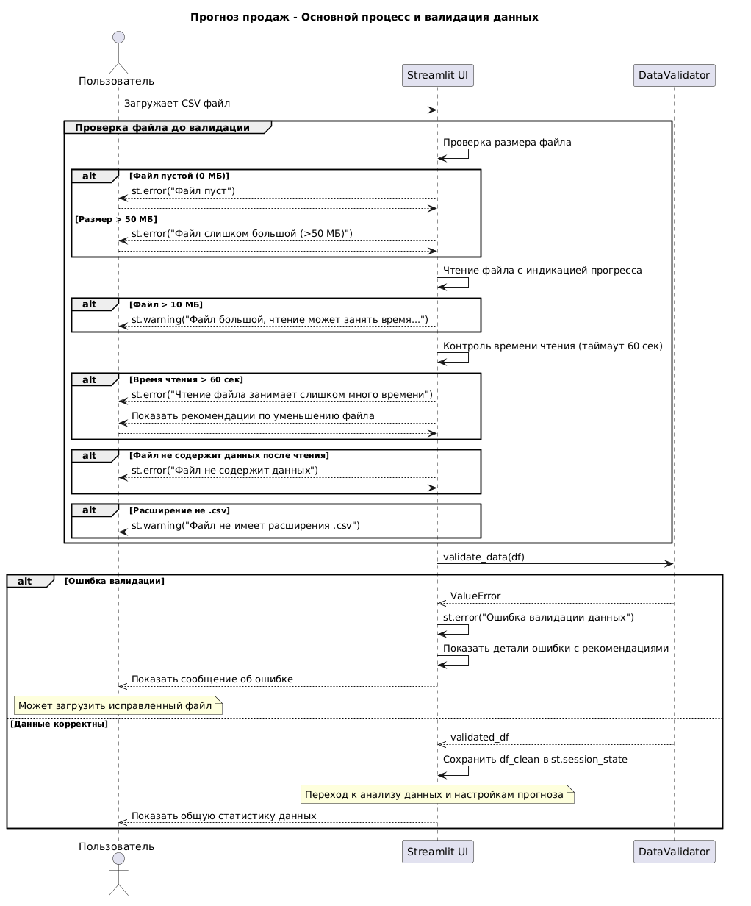

**Поток:**
1. User загружает CSV → Streamlit UI
2. DataValidator проверяет:
   - Обязательные поля (date, product_id, sales)
   - Форматы даты (DD.MM.YYYY, YYYY-MM-DD)
   - Длину product_id (≤ 100 символов)
   - Отрицательные продажи → 0
3. При ошибках → сообщение с рекомендациями
4. При успехе → данные в session_state
5. DataAnalyzer → статистика

---

### 2. Анализ исторических данных
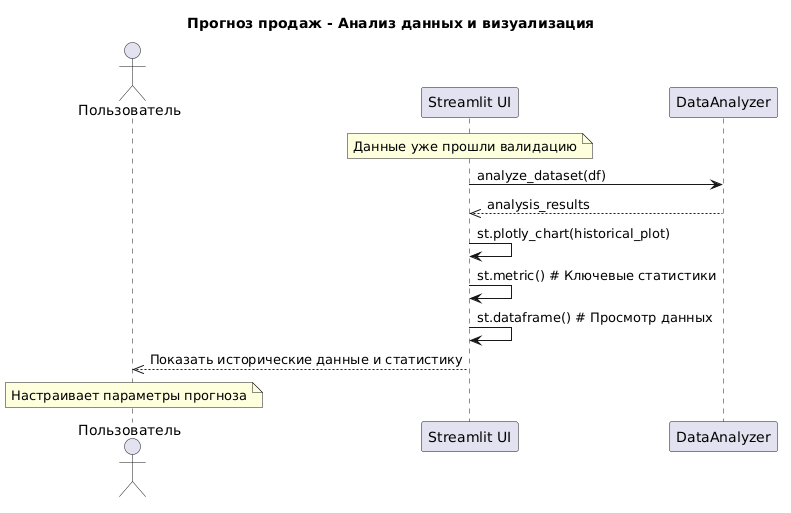

**Поток:**
1. DataAnalyzer вычисляет статистику
2. Streamlit отображает графики (Plotly)
3. Пользователь настраивает параметры

---

### 3. Создание признаков
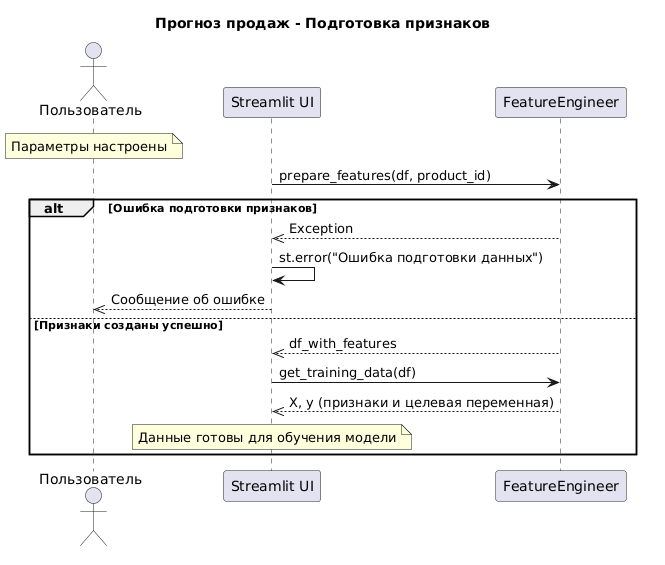

**Поток:**
FeatureEngineer создает 20 признаков:
- Временные (4): day_of_week, month, is_weekend, quarter
- Лаговые (4): lag_1, lag_2, lag_7, lag_14
- Статистические (4): rolling_mean/std (7, 14)
- Сезонные (3): is_holiday_peak, is_summer, is_winter
- Динамические (2): momentum, momentum_pct
- Ценовые (3+): price_lag, price_change_pct

---

### 4. Обучение модели
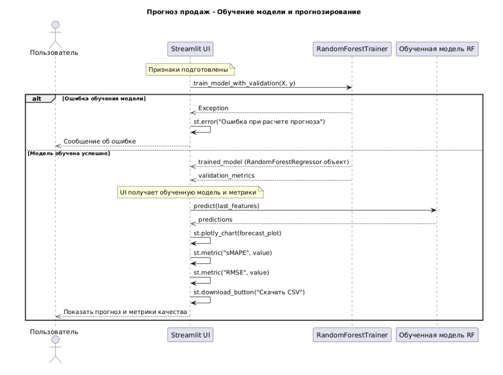

**Поток:**
1. RandomForestTrainer получает признаки
2. **Адаптивная стратегия:**
   - Один товар → GridSearchCV (оптимизация)
   - Общий спрос → фиксированные параметры
3. Кросс-валидация (TimeSeriesSplit, 3 фолда)
4. Метрики: sMAPE, RMSE
5. Генерация прогноза + доверительные интервалы (±20%)

---

### 5. Сценарный анализ
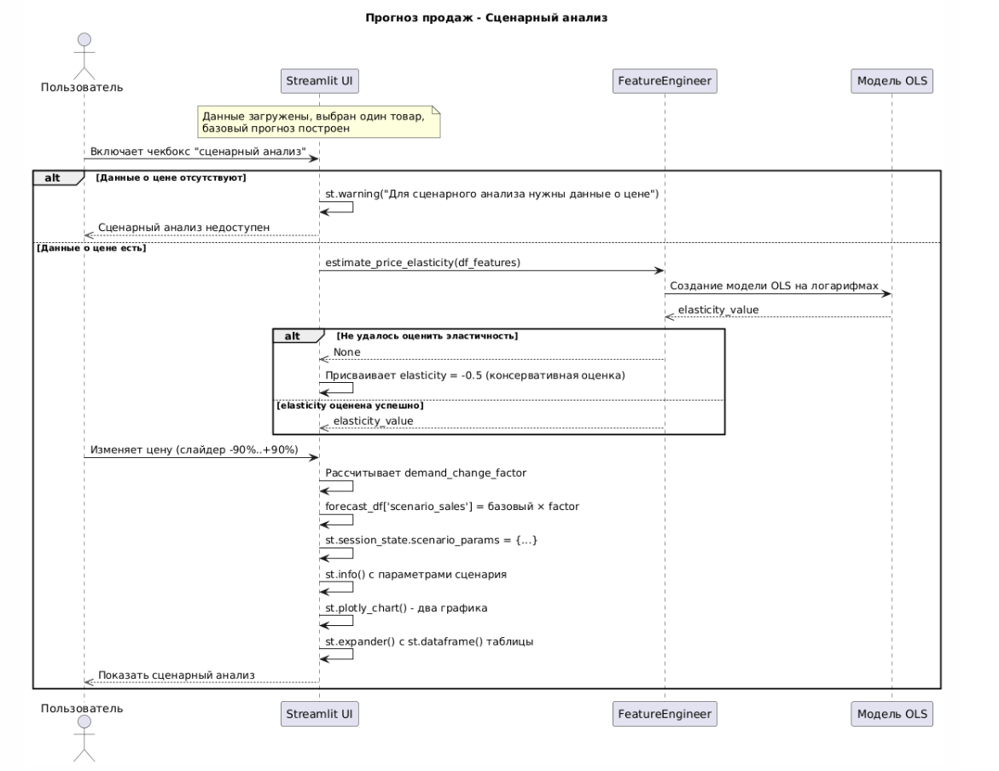

**Условия:** Есть цена + выбран один товар

**Поток:**
1. FeatureEngineer оценивает эластичность:
log(Sales) = β₀ + β₁ × log(Price)
Эластичность = β₁
2. Если не удалось → -0.5
3. Пользователь задает изменение цены (от -90% до +90%)
4. Расчет: `Scenario = Base × (1 + Elasticity × ΔPrice%)`
5. Сравнительный график + таблица различий

---

## Activity Diagram

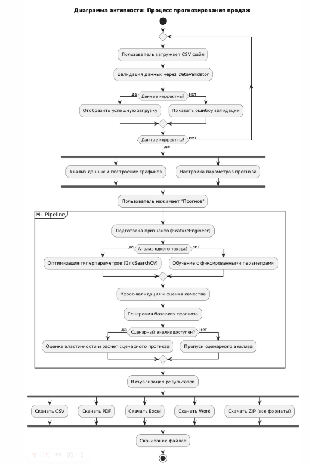

**Назначение:** Полный бизнес-процесс (от CSV до отчетов)

**Основные этапы:**
1. Загрузка CSV → Валидация → При ошибках: возврат
2. Параллельно: анализ данных + настройка параметров
3. Генерация 20 признаков
4. Ветвление:
   - Один товар → GridSearchCV
   - Общий спрос → быстрый режим
5. Кросс-валидация → Метрики
6. Базовый прогноз
7. Сценарный анализ (если есть цена)
8. Визуализация (графики + метрики)
9. Экспорт (CSV/PDF/Excel/Word/ZIP)
---

## Component Diagram

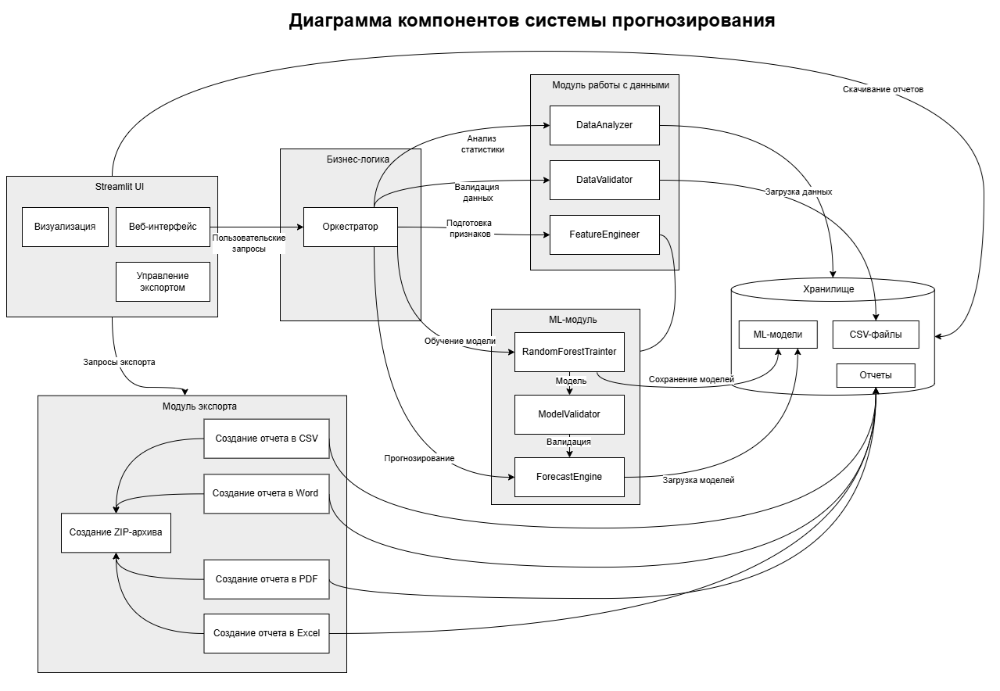

**Назначение:** Модульная архитектура с четким разделением на UI, бизнес-логику, ML-ядро и экспортные адаптеры.

### Компоненты 

#### 1. Streamlit UI (Фронтенд)
- **Визуализация** — отображение графиков прогнозов и метрик качества.
- **Веб-интерфейс** — панель управления для загрузки данных и настройки параметров.
- **Управление экспортом** — выбор формата и содержания отчета.
- **Запросы экспорта** — передача команд в модуль экспорта.

#### 2. Бизнес-логика (Ядро системы)
- **Оркестратор** — координация всех процессов (загрузка → валидация → инжиниринг → обучение → прогноз).
- **DataAnalyzer** — расчет статистик (средние, распределения, корреляции).
- **DataValidator** — проверка данных на пропуски, выбросы и соответствие схеме.
- **FeatureEngineer** — генерация 20 признаков, включая расчет эластичности.

#### 3. ML-модуль
- **RandomForestTrainer** — обучение модели случайного леса с подбором гиперпараметров (GridSearchCV + TimeSeriesSplit).
- **ModelValidator** — кросс-валидация и оценка точности.
- **ForecastEngine** — выполнение прогнозирования на новых данных.

#### 4. Хранилище 
- **ML-модели** — сохраненные файлы моделей (`.pkl` или `.joblib`).
- **CSV-файлы** — исходные и обработанные датасеты.
- **Отчеты** — сгенерированные файлы.

#### 5. Модуль экспорта
- **Создание отчета в CSV** — плоская таблица с прогнозом.
- **Создание отчета в Excel** — 3 листа: данные, прогноз, метрики.
- **Создание отчета в Word** — текстовое описание + таблицы.
- **Создание отчета в PDF** — с поддержкой шрифтов DejaVu для кириллицы.
- **Создание ZIP-архива** — упаковка всех форматов в один файл.

### Взаимодействие потоков
Streamlit UI → Оркестратор → DataValidator/DataAnalyzer/FeatureEngineer
→ RandomForestTrainer → ForecastEngine
→ Модуль экспорта → Хранилище (сохранение моделей + отчеты)
---

### Class Diagram
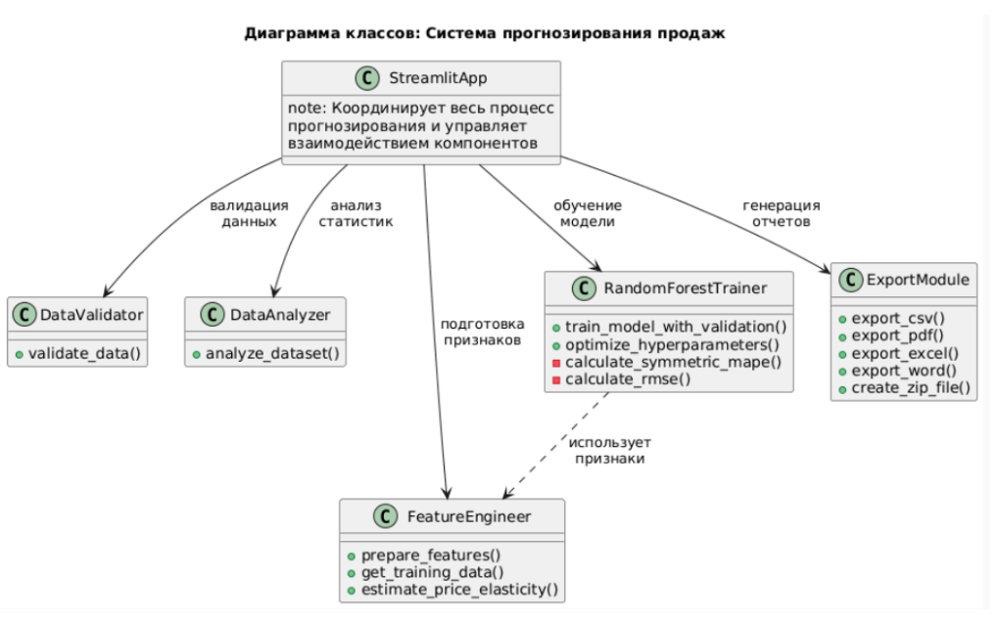

**Назначение:** Структура классов и их взаимодействие.

**Ключевые классы:**
- `StreamlitApp` — оркестратор всего процесса
- `DataValidator` — валидация и нормализация данных
- `FeatureEngineer` — генерация 20+ признаков + эластичность
- `RandomForestTrainer` — обучение с GridSearchCV и TimeSeriesSplit
- `ExportModule` — экспорт в CSV, PDF, Excel, Word, ZIP

**Связи:** `StreamlitApp` управляет всеми остальными классами последовательно (валидация → инжиниринг → обучение → экспорт).

---

### State Machine Diagram
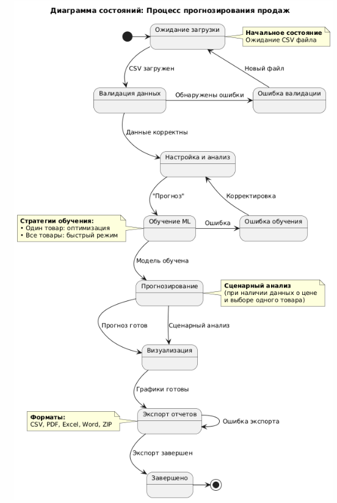

**Назначение:** Жизненный цикл прогнозирования.

**Основные состояния:**
Загрузка → Валидация → Анализ → Обучение ML → Прогноз → Экспорт → Завершено

- При ошибке — возврат на шаг назад
- Две стратегии обучения: *Один товар* (оптимизация) и *Все товары* (быстрый режим)

---

### Deployment Diagram
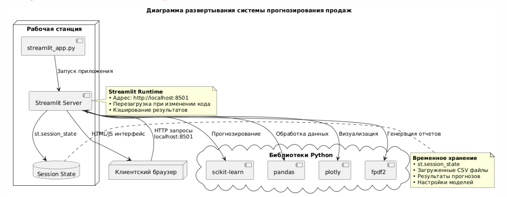

**Назначение:** Физическая архитектура развертывания.
**Структура развертывания:**

- **Client Browser** → HTTP (порт 8501)
- **Streamlit Server**
  - `app.py` — точка входа
  - `st.session_state` — данные, прогнозы, настройки
  - **Python библиотеки:**
    - `scikit-learn` — ML (RandomForest, GridSearchCV)
    - `pandas, numpy` — обработка данных
    - `streamlit, plotly` — UI и визуализация
    - `fpdf2, docx, openpyxl` — экспорт отчетов

**Локальный запуск:**
```
streamlit run app.py
# Доступ: http://localhost:8501
```
Облачное развертывание: Streamlit Cloud